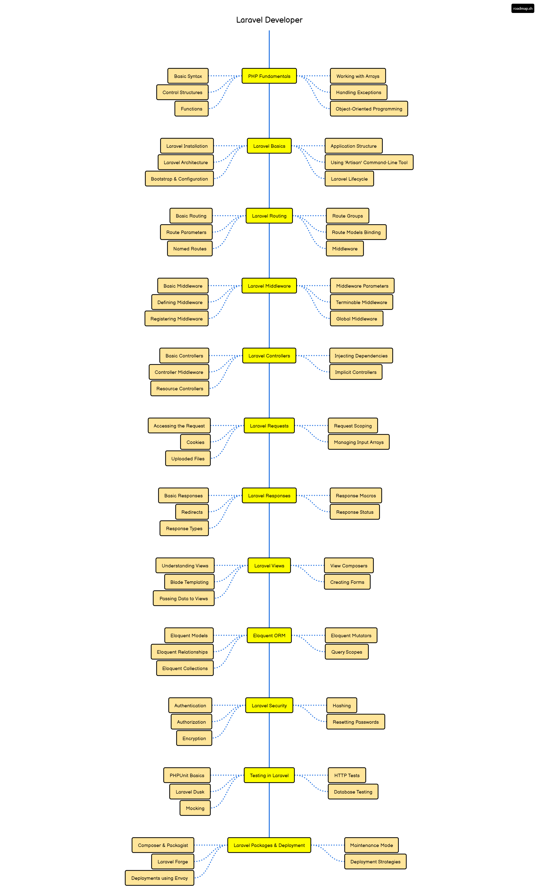
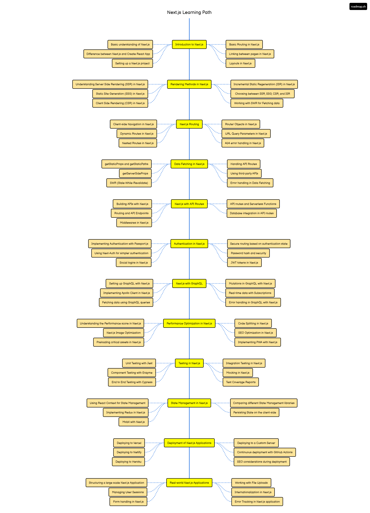
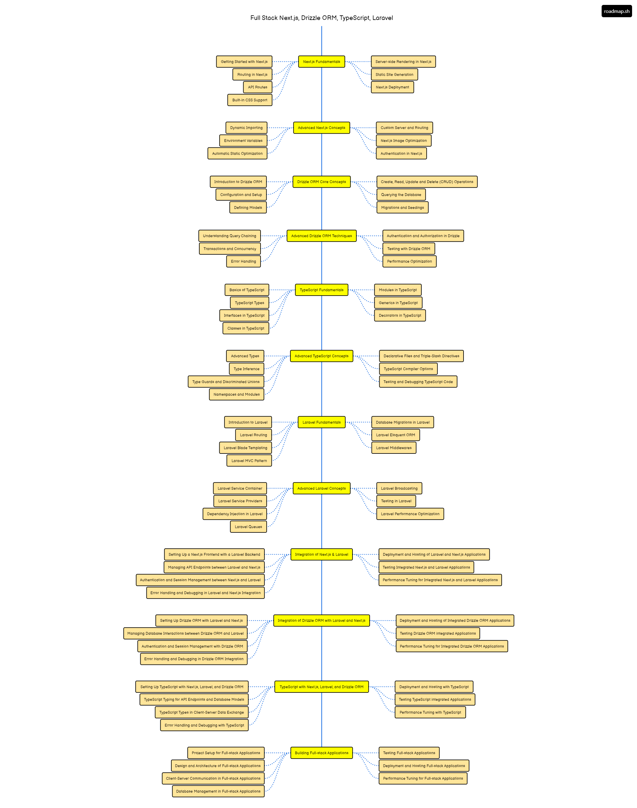

# FullStack app with Laravel and Next.js

This is a fullstack app with Laravel and Next.js. It is a simple app that allows users to create, read, update and delete posts.

## Learning Objectives

- Learn how to create a fullstack app with Laravel and Next.js
- Learn how to create a RESTful API with Laravel
- Learn how to create a frontend with Next.js
- Learn how to connect the frontend with the backend
- Learn how to deploy the app in production
- Learn how to use Docker to containerize the app
- Learn how to use Docker Compose to manage the app
- Learn how to use Nginx as a reverse proxy server
- Learn how to use Let's Encrypt to secure the app with HTTPS
- Learn how to use GitHub Actions to automate the deployment process
- Learn how to use GitHub Packages to store Docker images
- Learn how to use GitHub Secrets to store sensitive information
- Learn how to use GitHub Pages to host the app's documentation

## Prerequisites

- PHP
- Composer
- Node.js
- npm
- Docker
- Docker Compose
- Nginx
- Let's Encrypt
- GitHub Actions
- GitHub Packages
- GitHub Secrets
- GitHub Pages
- Laravel
- Next.js
- Tailwind CSS
- MySQL

##  Roadmap

- Laravel

- Next.js

## Fullstack Roadmap

